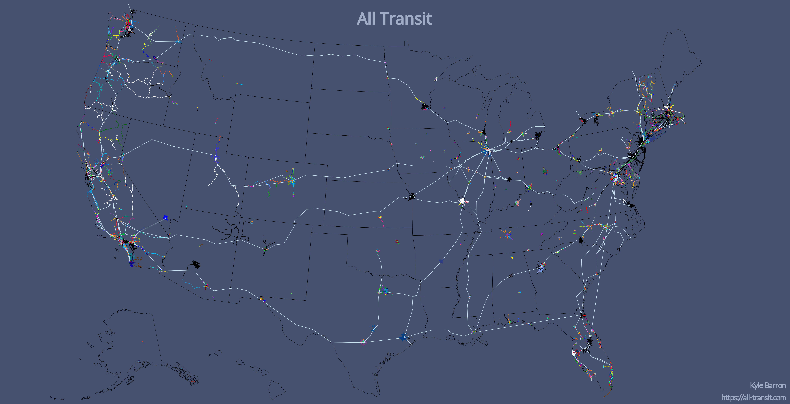
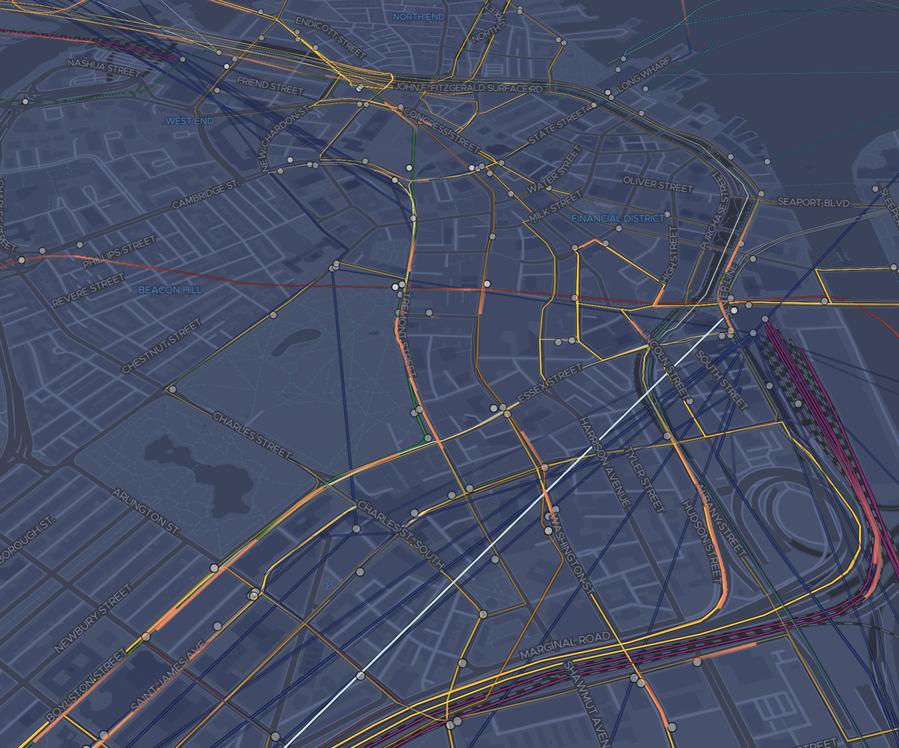

[Interactive map](https://all-transit.com)

Transit connects the densest cities but is also surprisingly prevalent in some
remote Western states. I wanted to find and display all these routes. Once I'd
done that for the U.S., why not the world? This project visualizes data from the
[Transitland](https://transit.land) project. The name alludes to [_All
Streets_](https://benfry.com/allstreets/map5.html).

[](https://all-transit.com)

The schedule animation is my favorite part of the project. If you zoom into a
city (currently U.S. only) you can see streaks moving around that correspond to
transit vehicles: trains, buses, ferries. This data takes actual schedule
information from the Transitland API and matches it to route geometries.

[](https://all-transit.com/#14.73/42.35435/-71.0638/31.8/46)

This rest of this blog post gives an overview of how the map is made.

### Transitland

I use the [Transitland](https://transit.land) project as my data source, which
compiles [GTFS feeds](https://gtfs.org/) from around the world, and harmonizes
the data into a single dataset. You can read more about why that's important
[here][transitland_onestop_id_scheme].

[transitland_onestop_id_scheme]: https://transit.land/documentation/onestop-id-scheme/

Transitland serves _static_ transit information; it does not currently support
GTFS real time feeds ([but could in the
future](https://github.com/transitland/transitland/issues/77)). Their data model
is split into five components: _Operators_, _Routes_, _RouteStopPatterns_,
_Stops_, and _ScheduleStopPatterns_.

An _operator_ is a transit agency that offers services to the general public
along fixed routes. A _route_ contains all information about a single transit
service as defined by the transit agency. A route can be a bit of a nebulous
topic, since often a single name has several branches. A _RouteStopPattern_
decomposes each route into a single linear geometry. A route can be defined by
one or many RouteStopPatterns. A _stop_ is each point along a route or
RouteStopPattern where passengers may get on or off. A _ScheduleStopPattern_
contains schedule information for each individual edge of the route. So if a
route has 10 stops in a line, there will be 9 ScheduleStopPattern data points
for each transit service scheduled along that route.

### Download

Currently, Transitland doesn't offer bulk downloads. In order to download all
the data I had to find the best way to find and store all the data through their
API endpoints, which they have for each of the five categories enumerated above.

Each of API endpoint allows for a geographic bounding box. At first, I tried to
just pass a bounding box of the entire United States to each endpoint and
download results a page at a time. Unsurprisingly, that method isn't successful
for the endpoints that have more data to return, like stops and schedules,
because each API request has a timeout of 120 seconds, and it takes a while to
find and return the unindexed one-millionth row in a database. [^1]

[^1]:

  It might be possible to use the database indexes better by providing the
  [`min_id` query
  parameter](https://github.com/transitland/transitland-datastore/issues/1254#issuecomment-424813471).

Because of this, I found it best in general to split API queries into smaller
pieces, by using e.g. operator or route identifiers. I ended up downloading
routes, route stop patterns, and stops by operator and schedule data by route. I
wrote a [Python/CLI wrapper][transitland_wrapper] for accessing the Transitland
database, to help with providing geometries and paging through all results.

[transitland_wrapper]: https://github.com/kylebarron/transitland_wrapper

**N.B.** I currently am hosting bulk downloads of the data I collected for the
project. You can find appropriate links on the [About
page](https://all-transit.com/about) of the project.

### Data Analysis

Most of the data-generating code for this project is done in Bash,
[`jq`](https://stedolan.github.io/jq/), GNU Parallel, SQLite, and a couple
Python scripts. In general, data is kept in _newline-delimited JSON_ and
_newline-delimited GeoJSON_ for all intermediate steps to facilitate streaming
and keep memory use low. However, I found that the schedule data was large
enough to necessitate transitioning to SQLite.

Operator, route, and stop information is encoded into [Mapbox Vector Tiles][mvt]
using [Tippecanoe][tippecanoe]. I use `jq` to reshape the source GeoJSON to keep
only necessary attributes of each Feature.


#### Schedule data

Schedule data from Transitland doesn't have a geometric component. In order to
connect schedules to geometries, you need to match the schedule data to the
routes _and_ stops data.

If you match schedule data just to routes, you have no way of knowing where
along the route the two stops are, and if you match schedule data just to stops,
you have no knowledge of the geometry between those two points.

Since some schedule data is missing links to route stop patterns, I first tried
to use _just_ the routes data. For each schedule stop pair, I found the `Point`
geometries of its start and end stops, found the nearest points on the route for
each of those stops, and retrieved the geometry between those two stops.

This can be problematic, however, because routes can have complex geometries.
For example, metro lines in Chicago might be represented geometrically as a
loop; starting in the suburbs, going downtown around The Loop, and back to the
suburbs. When I use this process to match the schedule stop pair to the route, I
sometimes match one stop to the first end of the route, and the other stop to
the other end of the route. This caused my program to think that the train went
to downtown Chicago and back in one minute, and the animation looked haywire
depicting a train moving through Chicago at 600 miles per hour.

Helpfully, most (though not all) schedule data is also linked to a route stop
pattern, and the schedule data also generally has linear referencing distances
along that route stop pattern. So for example, a schedule stop pair might say
that the origin stop is 100 (meters) along the route stop pattern's geometry and
that the destination stop is 900 (meters) along its geometry. This allows for a
much more accurate way of finding schedule geometries. I take the route stop
pattern, project it into a local coordinate system with units in meters (I use
the local [UTM zone][utm_zone]), and then cut the route stop pattern's
`LineString` geometry using those two distances using Shapely's [linear
referencing methods][shapely_substring].

[utm_zone]: https://en.wikipedia.org/wiki/Universal_Transverse_Mercator_coordinate_system
[shapely_substring]: https://shapely.readthedocs.io/en/stable/manual.html#substring

Once I have a geometry for that schedule, I linearly interpolate timestamps
along each coordinate between start and end. I export this data as GeoJSON
`Feature`s, where each geometry is a `LineString` with three-dimensional
coordinates: longitude, latitude, and time.

#### Schedule tiles

Now that I have these three-dimensional geometries, I need to figure out the
best way to transport them to the client. Unfortunately, at this time Tippecanoe
[doesn't support three-dimensional coordinates][tippecanoe_3d_issue]. The
recommendation in that thread was to reformat to have individual points with
properties. That would make it harder to associate the points to lines, however.

I decided to go with a custom data format; essentially tiled, gzipped, minified,
JSON. Since I know that all features are `LineStrings`, and since I have no
properties that I care about, I keep only the line's coordinates. The verbose
depiction of the data the client receives:

[tippecanoe_3d_issue]: https://github.com/mapbox/tippecanoe/issues/714

```json noLineNumbers
[
    // First LineString
    [
        // Coordinate of LineString
        [
            0, 1, 2
        ],
        // Coordinate of LineString
        [
            1, 2, 3
        ]
    ],
    // Second LineString
    [
        []
        ...
    ]
]
```

In order to make the data download manageable, I cut each JSON into xyz map
tiles, so that only data pertaining to the current viewport is loaded. For dense
cities with high frequency transit like Washington DC and New York City, some
tiles can still be quite large. I cut the schedule tiles into full resolution at
zoom 13, and then generate overview tiles for lower zooms that contain a
fraction of the features of their child tiles.

### Website

All portions of the website are self-hosted. The website itself is static and
hosted on Github Pages. The map tiles come from [OpenMapTiles][openmaptiles] and
are served with [`mbtileserver`][mbtileserver] on a Google Cloud f1-micro
instance. I have map tiles set to cache through Cloudflare to hopefully cope
fine with any spikes in demand. Vector tiles with operator, route, and stop
information are also hosted on the Google Cloud instance. The JSON tiles I use
for the schedule animation are currently hosted on AWS S3.

[openmaptiles]: https://openmaptiles.org/
[mbtileserver]: https://github.com/consbio/mbtileserver

The website is coded with React and JavaScript, using Gatsby as the static site
generator. I use React Map GL/Mapbox GL JS for rendering the basemap and the
routes layer. I use Deck.gl's [`TripsLayer`][tripslayer] on top for rendering
the schedule animation.

[tripslayer]: https://deck.gl/#/documentation/deckgl-api-reference/layers/trips-layer

### Performance

Although performance still isn't as good as I'd like on lower-powered and mobile
devices, it's better than where I started.

#### Minimize data downloads

The source data for routes and especially for schedule information is huge. In
order to serve this data over a web map, they need to be compressed and sliced
into smaller pieces to download. This is why [map tiling][map_tiling] exists.

[map_tiling]: https://en.wikipedia.org/wiki/Tiled_web_map

I use [Mapbox Vector Tiles][mvt] for transmitting operator, route, and stop data
to the client. Vector tiles are great because they're highly compressible, and
really easy to create with [Tippecanoe][tippecanoe].

In order to keep the size of the vector tiles small, the `stops` layer is
omitted until zoom 11, and the `routes` layer omits metadata about the stops on
each route until zoom 11. (The maximum zoom level of data in the vector tiles is
11, but the data will display past zoom 11 thanks to overzooming.)


[mvt]: https://docs.mapbox.com/vector-tiles/reference/
[tippecanoe]: https://github.com/mapbox/tippecanoe

_Unfortunately_, Tippecanoe only supports 2D data at this time. This means that
I had to develop my own solution for getting the schedule data to the client,
because I need a third dimension on those geometries (longitude, latitude,
time). For the time being I've settled on tiled, gzipped, minified, JSON. Since
I know that all schedule data are `LineString`s, I keep only the geometry part
of the GeoJSON, and don't transmit any properties data about each `Feature` to
the client.

Since I couldn't use Tippecanoe for generating these JSON tiles, I developed my
own workflow for cutting GeoJSON features into tiles. I chose a reasonably high
zoom level, 13, which contains all schedule data in the selected time period in
full resolution. For lower zooms, I take a random fraction of a tile's children
tiles to keep tile sizes reasonable.

#### Minimize data updates

I render invisble operator service area polygons so that I can easily find the
operators whose service area is in the viewbox. However I've found that
constantly updating the list of nearby operators when panning can impact
performance, so instead I only compute that list when the operators option panel
is open.

I also turn off the schedule animation when the current zoom is below the
minimum zoom at which I show the animation. I'm not sure how much this helps
performance because the Deck.gl `TileLayer` already is invisble below that zoom
threshold, but it can't hurt.

#### Deck.gl optimizations

Deck.gl has a [page in its documentation][deckgl_performance_opt] detailing
strategies for improving performance.

[deckgl_performance_opt]: https://deck.gl/#/documentation/developer-guide/performance-optimization

I set `useDevicePixels` to `false`. When `true`, this prop tells Deck.gl to
render at double the resolution on a high DPI display, which means that it must
do 4x the pixel computations. When the animation is more important than the
crispness of the map rendering, set this to `false`.

I also attempted to use precomputed binary attributes but hit some errors and
decided it wasn't worth it to debug right now. In the future I'd like to figure
out how to use binary data directly.
