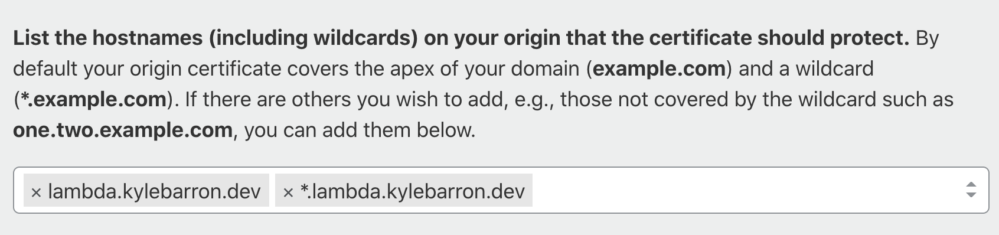

[Cloudflare][cloudflare] is a Content Delivery Network (CDN), a global network
of servers that cache responses from websites so that those responses can load
more quickly for future website visitors. A CDN has dual benefits: your website
becomes faster for your visitors, but _also_ fewer traffic reaches your origin
web server, reducing load. For Cloudflare specifically, they have a generous
free tier, so for most personal projects, it's more than enough for my needs.

[cloudflare]: https://www.cloudflare.com/

I'm building some projects around AWS Lambda, a powerful serverless platform
that allows you to respond to network requests in a completely scalable way.
When your traffic is zero, your costs are zero, but if your website goes viral,
you'll be able to scale to a huge number of requests quickly.

Cloudflare is especially helpful alongside AWS Lambda because pricing is done
per request, so the fewer requests that reach your Lambda function, the cheaper
it'll be to run.

This post is a high-level overview of how to connect Lambda and Cloudflare.

### Overview

[This StackOverflow answer][so_api_gateway_cloudflare] on connecting API Gateway
to Cloudflare is extremely helpful, so much of this post is essentially
rehashing that answer for my future reference.

[so_api_gateway_cloudflare]: https://stackoverflow.com/a/45849093

#### Set up Cloudflare

First you need to set up a Cloudflare account and attach a domain you own. This
is relatively self-explanatory. Go to <https://cloudflare.com>, sign up, and
follow their instructions for attaching your domain name and pointing your DNS
towards Cloudflare's nameservers.

#### Create certificate

Since API Gateway requires all outbound traffic to be encrypted, you need to
create an SSL certificate to upload to AWS to tell how to encrypt your data. The
simplest way to create this certificate is through the Cloudflare dashboard.
Cloudflare will helpfully also renew the certificate as needed.

Go to your website in Cloudflare's UI and then choose "SSL/TLS" > "Origin
Server". Then click "Create Certificate".

The only thing you need to change is the hostnames field. Since I'll put my
endpoints at `lambda.kylebarron.dev/*`, I enter the following hostnames:

Upon continuing, you see the generated certificate. It's crypto gibberish, but
you should keep a record of this, but for the next few steps, and possibly
longer term in your password manager.

#### Import Certificate

Navigate to the AWS Certificate Manager (ACM) console. This should be easily
found through the AWS web UI.

**Note**: In general, you should upload to `us-east-1`. However, I'm using the
newer, cheaper HTTP API Gateway endpoint instead of the older REST API Gateway
endpoint. For the HTTP API Gateway endpoints, **the certificate needs to be
uploaded to ACM in the same region as the lambda functions**. I also don't
think there's a downside to uploading your certificate to multiple regions.

Click "Import Certificate". Then where it says "Certificate body", paste your
**Origin Certificate** from the previous step. Where it says "Certificate
private key", paste your **Private key** from the previous step. For the
"Certificate chain", that's a special public key from Cloudflare. To retrieve
it, go to [this Cloudflare help page][ca_root_page], scroll down to "Step 4 -
Add Cloudflare Origin CA root certificates", and expand "Cloudflare Origin CA —
RSA Root". Then paste that value into the AWS ACM box. Click "Next". Add a tag
if you'd like, then click "Import".

[ca_root_page]: https://support.cloudflare.com/hc/en-us/articles/115000479507

#### Add custom domain to API Gateway

Go to the API Gateway console. Then choose "Custom Domain Names" on the left.
Then click "Create". Enter your domain name, which must match the one provided
when you created the certificate. Since I use this for personal projects, I'm
content with "Regional", which likely has lower availability than
"Edge-optimized", but is still very high. Then choose the ACM certificate you
just uploaded that also matches the same domain name. Then click "Create".

#### Configure domain mappings

Now you've created a certificate, imported it to Amazon, and connected it with a
custom API gateway domain. But you need to tell API Gateway which API to call
when that domain is requested. On the same page as the last step, click
"Configure API mappings", then "Add new mapping". Use the boxes to associate
paths to APIs and then click "Save". Note that if the path is `/endpoint`,
you'll reach that API by calling `your_domain/endpoint`.

#### Connect Cloudflare to that API Gateway domain

Now you need to tell Cloudflare to route traffic from your custom domain name to
API Gateway. Make note of the "API Gateway domain name" on the API Gateway page
where you just added a custom domain. Then go back to the Cloudflare dashboard
and click the "DNS" tab. Then add a **`CNAME`** record, where "Name" is the
subdomain name, and "Target" is that "API Gateway domain name". Click "Save".

#### Set SSL to Full (Strict)

Last, you need to set your SSL mode to "Full (Strict)". If you're ok with the
_entire domain_ being "Full (Strict)", you can go to "SSL/TLS" and switch the
encryption mode to "Full (Strict)".

I use the same base domain for traffic served directly from S3. Since S3 doesn't
support HTTPS traffic, I need to have Cloudflare's SSL setting set to Flexible,
which means that traffic is encrypted between the user and Cloudflare, but not
between Cloudflare and S3. However I need to serve traffic to AWS API Gateway
with HTTPS.

To get around this, I add a Cloudflare page rule, so that just this API Gateway
traffic is set to "Full (Strict)". Click the "Page Rules" tab, click "Create
Page Rule", add a string matching your domain name(s). Then choose "SSL" as the
setting, and set the setting to "Full (Strict)". Then click "Save and Deploy".

### Conclusion

You should now be able to access your API endpoint through your custom domain!
In order for Cloudflare to cache your content, you need to set applicable
`Cache-Control` headers, such as `public,max-age=3600`, to cache on both a
user's browser and on Cloudflare's server for a period of 1 hour. If the file
extension is not one [cached by default][cached_extensions], you'll need to set
a "Cache Everything" page rule.

[cached_extensions]: https://support.cloudflare.com/hc/en-us/articles/200172516-Understanding-Cloudflare-s-CDN#h_a01982d4-d5b6-4744-bb9b-a71da62c160a

In order to find out if any given request was served from Cloudflare's cache,
you can inspect the `cf-cache-status` header on the response. If the value is
`HIT`, the asset was served from Cloudflare's cache.

**Footnotes**:

If you use the HTTP API endpoints, you need the certificate to be in _the same
region_ as the API. However that also means that if you have HTTP API's in two
separate regions, you can't use one domain for both. You'll have to create a
separate domain for each region. For the Cloudflare page rule, set an asterisk
like `*lambda.domain`, so that you can use one page rule for all subdomains.
