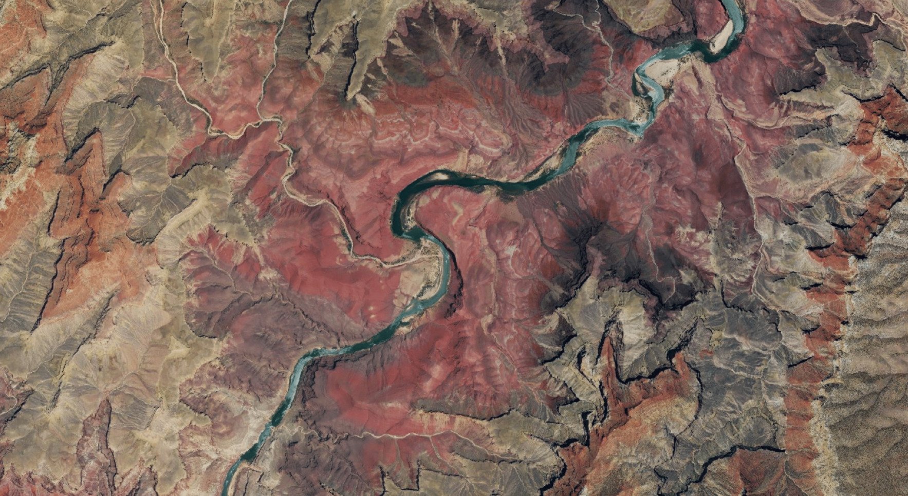

[][naip-example]

60cm-resolution imagery of the Grand Canyon from 2017. **[Click for an
interactive example][naip-example]**.

[naip-example]: https://kylebarron.dev/naip-cogeo-mosaic

## Overview

More and more public imagery sources are being provided in [Cloud-Optimized
GeoTIFF (COG)][cogeo], an efficient file format for fast random-access reads
of geospatial raster data. This is revolutionary because the format enables new
cloud-native workflows, such as serving imagery to a web map on demand, that
were never before possible.

Within half a second, a server can grab and combine the relevant portions of
half a dozen images, reproject into the coordinate reference system used in web
mapping, and return it to the user. Making this process happen on demand can
lead to huge reductions in cost—and zero fixed cost—as terabytes of map data no
longer need to be stored pregenerated and stored.

This post builds upon a [previous overview post][cog_intro_post] to give more
concrete details on working with the [public NAIP collection on AWS
S3][aws_naip], a repository of cloudless aerial imagery spanning the lower 48
U.S. states at up to 60-centimeter resolution. In the following sections I'll
give an overview of the imagery available and best practices for optimal
performance. For deployment instructions and other documentation, [visit the
project on Github][naip-cogeo-mosaic].

## NAIP Data

The U.S. Department of Agriculture (USDA) oversees the [National Agriculture
Imagery Program (NAIP)][usda_naip]. Since 2003, this program has collected
high-resolution aerial imagery of the continental U.S., with recent years
photographed at 60-centimeter resolution. This data has been free to use for a
while, but historically has been locked in cloud-unfriendly,
[closed-source][mrsid] formats.

[usda_naip]: https://www.fsa.usda.gov/programs-and-services/aerial-photography/imagery-programs/naip-imagery/
[mrsid]: https://en.wikipedia.org/wiki/MrSID

However, thanks to the AWS Open Data program, NAIP imagery from 2011 to 2018 is
available on a [public S3 bucket][aws_naip] in [Cloud-Optimized GeoTIFF
(COG)][cogeo] format. As I explained in a [previous blog post][cog_intro_post],
COGs democratize access to large collections of raster data by enabling fast
random-access reads.

[aws_naip]: https://registry.opendata.aws/naip/
[cog_intro_post]: https://kylebarron.dev/blog/cog-mosaic/overview
[cogeo]: https://www.cogeo.org/

Given this large collection of data freely available in a cloud-friendly format,
we can render map tiles from this imagery on demand with low latency, generally
within 500ms. This on-demand rendering provides multiple benefits:

- Lower costs. By not storing a copy of the data, you can avoid storage costs for pregenerated imagery. Source NAIP data is over 30TB in size; just to store that data on S3 would cost several hundred dollars a month.
- Greater image selection flexibility. By not pregenerating any imagery, you can give users the choice of what year's data to view. As soon as a new year's data exists, your maps can be updated.

## MosaicJSON

As described in my [COG overview blog post][overview_post_mosaicjson]:

[overview_post_mosaicjson]: https://kylebarron.dev/blog/cog-mosaic/overview#mosaicjson

> It's great that all those terabytes of COG exist for public consumption, but
> you still need a way to select what portions of imagery to combine. That's
> where [MosaicJSON][mosaicjson] comes in. It's a file that determines what
> source files should be merged to create each web mercator map tile.

Dynamic tiling works by combining multiple source images into a single output
image in the web mercator projection ready to send back to the client. This
process requires quickly finding the source images that are necessary to combine
for the desired tile.

[mosaicjson]: https://github.com/developmentseed/mosaicjson-spec

In the NAIP case, the process of assembling a MosaicJSON is relatively simple as
the source imagery is intentionally collected in such a way as to create a
seamless mosaic per state. Images are produced in a regular grid with little
overlap between source images, all imagery is cloudless, there exists minimal
temporal variation (at least within a state), and the dataset is relatively
static (updated yearly).

These factors make it considerably easier to work with mosaics for NAIP imagery
than for satellite imagery, which has more overlap between scenes, large
portions of missing or cloudy data, and high temporal variation.

The main thing to keep in mind when creating an NAIP mosaic is to avoid
including multiple years of imagery in a single mosaic, which can slow down
dynamic tiling. Most of `naip-cogeo-mosaic` is dedicated to working with the
NAIP metadata to create a seamless, efficient mosaic. Consult [its
documentation][naip-cogeo-mosaic] for more information.

## Image Overviews

Cloud-Optimized GeoTIFF files include a number of internal _overviews_:
lower-resolution, downsampled versions of the image, which are precomputed and
stored with the image. Each overview level halves the height and width pixels,
so each additional level reduces the resolution by a factor of 2. These
overviews enable fast reads at a range of resolutions by minimizing the
amount of bytes that need to be read.

NAIP imagery in the `naip-visualization` S3 bucket have full-resolution data
plus 5 levels of overviews. This means that NAIP data can be read most
efficiently at _six_ zoom levels, in this case zooms 12-17. At zooms higher than
17, the images look pixelated. At zooms lower than 12, many images need to be
combined and downsampled on the fly. To create an image for a single zoom 6
mercator tile, you'd need to read _4,096_ times more data at level 12, then
downsample.

Unsurprisingly, needing to fetch so many source images reduces performance when
rendering at lower zooms. A solution to this problem is to create _pregenerated
overviews_ for lower zooms: reading all necessary source images once then
downsampling ahead of time. Then when rendering lower zoom images, read from the
already-downsampled data.

In this case, to serve imagery for zooms 6-11 on the fly, I generate overview
images that are themselves Cloud-Optimized GeoTIFFs, each of which contains 5
internal overview levels. Pregenerating overviews does lose some flexibility of
COGs, as you need to choose how to combine imagery (your MosaicJSON) ahead of
time rather than on demand.

The [`naip-cogeo-mosaic` documentation][naip-cogeo-mosaic] has more information
on how to use [`cogeo-mosaic`][cogeo-mosaic] to create these overviews.

## Dynamic Tiling Performance

I've spent a lot of time working on performance for dynamic tiling, with the
goal of reducing latency to the point that it's viable for a wide range of
applications.

With my current serverless solution hosted on AWS Lambda, I'm able to get around
500ms latency (longer for cold starts). In the following sections I'll outline
the things you should keep in mind to keep performance as high as possible.

### Minimize number of source assets

Since GDAL, the program underlying the dynamic tiling process, is synchronous,
the largest amount of time is spent waiting on network requests to S3 for each
portion of the image. Thus, one of the best ways to minimize total time is to
minimize the number of images the tiler has to fetch to combine into a single
web mercator tile.

As [described above](#mosaicjson), this step is done ahead of time, while
creating the MosaicJSON. The process of minimizing superfluous source assets is
taken care of within `naip-cogeo-mosaic` when you make a mosaic.

### 256x256 pixel images

Images used in web maps usually come in square images of either 256x256 pixels
or 512x512 pixels (@2x resolution). Using @2x resolution tiles requires fewer
requests to cover the screen, since each image covers a larger area at the same
resolution, but each request takes longer. With @1x scale tiles, each tile is
1/4th the size, so you'll need (roughly) four times the requests.

With this project, my goal is to push per-tile latency as low as possible.
Unsurprisingly, it takes significantly longer—my ballpark estimates are around 2
to 3 times longer—to generate a @2x scale image than a @1x scale image. Thus,
serving @1x scale images is preferable when you prioritize speed, but server
costs will be slightly higher since you need so many more requests.

### Locate server in `us-west-2`

The tiler works by

1. Using the MosaicJSON to find URLs of source images that overlap the mercator tile of interest
2. Reading the relevant portion of each source image
3. Combining pixels into one output image ready to send back to the client

While these three steps work with any file format, Cloud-Optimized GeoTIFFs
allow for huge speedups on the second part. The COG format is efficient because
it allows for intelligent streaming of portions of an image, but because a COG
is internally tiled, the tiling server will likely need several (small) GET
requests for each source image. Thus, locating the compute in the same region as
the data is absolutely essential for low total latency, as the latency for each
S3 GET request is larger across regions, and this time gets multiplied by the
number of requests per image, and the number of images needed to combine for one
mercator tile.

Additionally, since NAIP imagery is stored in a Requester Pays S3 bucket,
locating the server in the same region will be significantly cheaper as you
won't need to pay egress charges on intermediate data transfer.

### Use GDAL 2.4, not 3.1

As of summer 2020, GDAL 2.4 has been tested to be [_significantly
faster_][gdal2_slow] ([>10x][gdal2_speedup]) than GDAL 3.1, at least for this specific
use case.

[gdal2_slow]: https://github.com/lambgeo/docker-lambda/issues/2
[gdal2_speedup]: https://github.com/developmentseed/cogeo-mosaic-tiler/issues/4#issuecomment-604120617

### Use DynamoDB as the MosaicJSON backend

The MosaicJSON defines a mapping from mercator tiles to image urls. Since it
must define this mapping for _every mercator tile_ (at the minimum zoom, which
for NAIP is zoom 12), the MosaicJSON file can get quite large. When saved as a
JSON file, my United States-wide mosaics are 64MB. Since this mosaic is needed
for every dynamic tiling request, storing this data in a JSON file on S3
requires the lambda function download and parse it on every request. This adds
roughly 2.5s per request for such a large mosaic.

Luckily, there's an alternative to storing as JSON.
[`cogeo-mosaic`][cogeo-mosaic] supports multiple _backends_, one of which is
[DynamoDB][dynamodb], a serverless, low-latency key-value store. This is ideal
for storing mosaics because only one or sometimes two DynamoDB read requests are
necessary per dynamic tiling request. This lowers the time spent on the
MosaicJSON from 2.5s to around 20ms.

[dynamodb]: https://aws.amazon.com/dynamodb/

### Client-side image manipulation

Often the NAIP imagery is visually a bit bland and benefits from increased
saturation. While it's possible to do this server side, it increases image load
times by 100-200ms. For WebGL-enabled map clients like Mapbox GL JS or
[deck.gl](https://deck.gl), client-side image saturation is easy and
instantaneous, so this is better to do client side.

### Caching

I'm a big fan of Cloudflare's free tier as a simple solution to both speed up my
site and keep costs low by reducing the number of requests that reach my server.
Some sort of caching is ideal.

## Pricing

A rough estimate of the cost with my serverless approach is **$25 per million
requests**. Note that this is only for requests _that reach Lambda_; using
Cloudflare with a long Cache-Control setting should make it effectively even
cheaper.

- Lambda compute time: $12.5/million requests. On average, each request takes around 500 ms, when Lambda is set to 1536 MB of memory. Note that this is for @1x tiles; @2x tiles take 2-3x longer for compute (but you need fewer requests). If you have significant, stable usage, you could save by not going serverless.
- Lambda requests: $0.20/million.
- DynamoDB requests: $0.25/million. Each dynamic tiling request needs a read request to DynamoDB to find the relevant image urls.
- API Gateway requests: $1.00/million. I use the cheaper, newer HTTP API service instead of the older REST API service, which is $3.50/million.
- S3 GET requests: $8.00/million. Since NAIP imagery is stored in a requester pays bucket, the user pays for the GET requests. On average there are 4 to 6 source images, and each COG requires between 1 and 5 GET requests, depending on the zoom level and technical factors.
- Network egress: $2.00/million. Assuming image tiles are served as JPEGs, each image is roughly 25kb. Multiply by 4 if using @2x tiles. PNGs are significantly larger.

This is a pretty good value. Once you surpass Mapbox's (generous) free tier,
their satellite imagery costs $250/million requests. (Though that's not a direct
apples-to-apples comparison, since you can request @2x tiles from Mapbox for
apparently the same price.) But apart from being cheap, a great benefit of the
dynamic tiling approach is that you can choose _any_ combination of imagery you
wish. It's just as easy to serve tiles from 2011 as it is from 2018.

## Drawbacks

That said, there are a few drawbacks to using NAIP imagery and reasons why tiled
imagery from a commercial company such as Mapbox can often be better.

- **No global coverage**: NAIP data only exists for the continental U.S. The highest-resolution public, global satellite imagery I know of is Sentinel 2 data, which has a 10-meter resolution.
- **Image quality**: while NAIP generally has good image quality, across large areas seams are quite noticeable. NAIP is ideal when zoomed in; it can look downsampled and patchy at low zooms.
- **Missing areas within U.S.**: some areas within the continental U.S., especially military bases, are not photographed by the NAIP program.

Since this project was designed for exploration and to be "good enough" for
hobby mapping projects, these drawbacks are fine for my needs.

## Conclusion

If you appreciate this data, **talk to your elected officials**. [According to
Wikipedia][naip_wikipedia], USDA is considering removing NAIP imagery from the
public domain in the near future.

[naip_wikipedia]: https://en.wikipedia.org/wiki/National_Agriculture_Imagery_Program

## References

- [`naip-cogeo-mosaic`][naip-cogeo-mosaic]: the open source project underlying this blog post. Refer to its documentation for how to deploy.
- [Titiler][titiler]: a next-generation dynamic tiling server that supports both serverless and server deployment. I'd recommend this over `cogeo-mosaic-tiler` for all new deployments.

[titiler]: https://developmentseed.org/titiler/

## Acknowledgements

Thanks to [Vincent Sarago][vincent], [Jeff Albrecht][jeff], and many others for
their invaluable feedback and work pushing the Cloud-Optimized GeoTIFF ecosystem
forward.

[vincent]: https://twitter.com/_VincentS_
[jeff]: https://twitter.com/geospatialjeff
[naip-cogeo-mosaic]: https://github.com/kylebarron/naip-cogeo-mosaic
[cogeo-mosaic]: https://github.com/developmentseed/cogeo-mosaic
