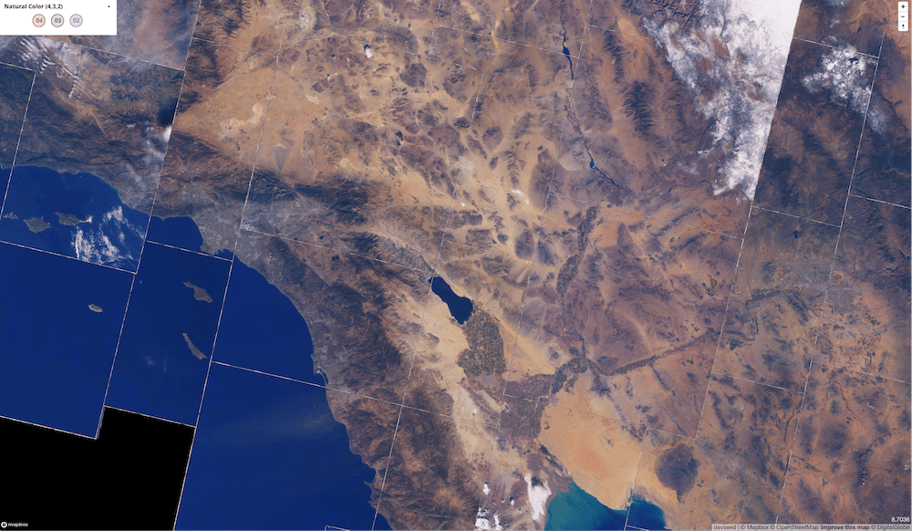

## Overview

There's a new way to serve a raster basemap.

Historically, the barrier to entry of serving an image basemap was
quite high. You had have access to high quality satellite imagery, the compute
power to preprocess those images into the right format for the web, the storage
capability to store all that data, and the server capability to handle spikes in
traffic.

All that has changed.

With the advent of serverless computing, the Cloud-Optimized GeoTIFF (COG)
format, and large public repositories of such data, serving map tiles from large
collections of imagery is being democratized. It's now possible to serve tiles
on demand from a collection of terabytes of imagery, quickly, cheaply, and
easily.

In this post, I present an outline of this new ecosystem, and lay the groundwork
for future blog posts where I put this theory into practice, and show how to
implement these tools with existing, open data sets.

## Cloud-Optimized GeoTIFFs

As described on [cogeo.org](https://www.cogeo.org/):

> A Cloud Optimized GeoTIFF (COG) is a regular GeoTIFF file, aimed at being hosted on a HTTP file server, with an internal organization that enables more efficient workflows on the cloud. It does this by leveraging the ability of clients issuing ​HTTP GET range requests to ask for just the parts of a file they need.

This new format is at the core of dynamic tiling. By making use of its internal
image _overviews_, one can read _parts_ of the image over a network roughly in
proportion to the amount of data requested. The client needs only to read the
file's inital metadata to know the exact pattern and byte ranges of the rest of
the file. Then to read an image's top-right corner at mid-resolution, a minimal
number of additional requests can be made just for that data.

There are several large collections of publicly-available COG data, including:

- [Landsat 8][landsat8_aws]: Worldwide, medium resolution multi-spectral imagery since 2013, with new scenes added daily.
- [NAIP][naip_aws]: High resolution (1-meter and 0.6-meter) true color "leaf-on" imagery for the continental 48 U.S. states, taken at regular intervals since 2011. Most states have been imaged four times since 2011.
- [MODIS][modis_aws]: Worldwide, low resolution multi-spectral imagery captured by the MODIS satellite.
- [CBERS][cbers_aws]: Medium resolution imagery captured by the China-Brazil Earth Resources Satellite. It doesn't have worldwide coverage, however.
- [USGS Historical Topographic Maps][usgs_htmc]: 181,000 topographic maps, created between 1884 and 2006, covering U.S. territory. These files have been scanned, georeferenced, and saved in COG format in a public S3 bucket.

NAIP, MODIS, and CBERS imagery is stored in requester-pays buckets, which means
that the requester pays the cost of the `GET` request and the data transfer, but
as we'll see in future blog posts, this is a small cost as long as the tiler is
located in the same region as the data.

Additionally, high-resolution USGS elevation data [is being
converted][usgs_3dep_cog] to COG, with expected launch in 2020, and there are
rumors that Sentinel 2 data may be available in COG in the future.

[landsat8_aws]: https://registry.opendata.aws/landsat-8/
[naip_aws]: https://registry.opendata.aws/naip/
[modis_aws]: https://registry.opendata.aws/modis-astraea/
[cbers_aws]: https://registry.opendata.aws/cbers/
[usgs_3dep_cog]: https://www.usgs.gov/news/usgs-digital-elevation-models-dem-switching-new-distribution-format
[usgs_htmc]: https://www.usgs.gov/core-science-systems/ngp/topo-maps/historical-topographic-map-collection?qt-science_support_page_related_con=0

## MosaicJSON

It's great that all those terabytes of COG exist for public consumption, but you
still need a way to select what portions of imagery to combine. That's where
[MosaicJSON][mosaicjson] comes in. It's a file that determines what source files
should be merged to create each web mercator map tile.

MosaicJSON files add flexibility to the system. I can switch combinations of
imagery by switching the MosaicJSON file that I pass to the tiler. For example,
I've generated a couple dozen MosaicJSON files representing cloudless Landsat 8
combinations: one per season since 2013. It's then easy to expose image
selection options to the user by changing the MosaicJSON url to give to the
tiler. (Deeper explanation coming in future blog post).

[mosaicjson]: https://github.com/developmentseed/mosaicjson-spec

## Serverless Computing

[Serverless computing][serverless_computing] is the last part of the puzzle.
With services like AWS Lambda, one can set up dynamic tiling for a hobby
project, and never have to manage servers. AWS Lambda will scale up and down
with demand. If your project generally receives little traffic, but once in a
while goes viral, you pay very little when you have no visitors, but are still
able to scale quickly to whatever level is necessary.

To be clear, going serverless is not a _necessary_ part of the puzzle. If you
plan to serve map tiles at scale, it may be more performant or cheaper to
maintain your own servers, but the maintainance overhead needs to be taken into
account.

At this stage, I plan to use dynamic tiling for hobby projects, and not having
to manage servers is a big plus.

While serverless computing is sometimes more expensive than running and
maintaining a server, serving tiles is still cheaper than some paid services. A
rough cost estimate for on-demand tiling of Landsat 8 data is $50 per million
tiles. As a comparison, once (if) you surpass Mapbox's (very generous) free
tier, their pricing is $0.25 per 1000 requests, or $250 per million.
Furthermore, I aggressively [cache my Lambda responses with
Cloudflare][cache_cloudflare] to minimize the requests that reach the origin.

[cache_cloudflare]: /blog/caching-lambda-functions-cloudflare

But overall, part of the allure of dynamic tiling is the flexibility from being
able to choose _any_ imagery on demand. You aren't restricted to what Mapbox
selects for their satellite basemap.

[serverless_computing]: https://en.wikipedia.org/wiki/Serverless_computing

## Ecosystem

Over the last few months, and along with [Vincent Sarago][vincent_sarago] and
[Jeff Albrecht][jeff_albrecht], I've been helping to build out an ecosystem of
open source tools to make dynamic tiling fast and reliable.

[vincent_sarago]: https://twitter.com/_vincents_
[jeff_albrecht]: https://github.com/geospatial-jeff

There are several interrelated tools. It's easy to get them confused.

Here's an overview of the ecosystem.

#### `rio-tiler`

[`rio-tiler`][rio-tiler] is at the core of the ecosystem. It's a library whose
main purpose is to create a mercator tile from a given input image. In contrast
to some of the following libraries, it takes a _single_ input path and returns a
_single_ output image. It forms the core of some other libraries.

With the "standard" tiler, you provide a path to a COG image and a standard
`xyz` mercator tile, and it returns data for that mercator tile. Specifically,
it returns _two objects_, `data` and `mask`, which allow you to ascertain what
portions of the mercator tile are not covered by the source image. `rio-tiler`
also includes some "mission-specific" tilers for Landsat 8, Sentinel 1 and 2,
and CBERS. These allow you to pass an _identifier_ to a satellite scene, and the
tiler will find the data corresponding to that scene on AWS S3.

[rio-tiler]: https://github.com/cogeotiff/rio-tiler

_September 2020 update_: With the upcoming `rio-tiler` v2.0 release,
mission-specific tilers have been refactored into a separate module,
[`rio-tiler-pds`][rio-tiler-pds].

[rio-tiler-pds]: https://github.com/cogeotiff/rio-tiler-pds

#### `rio-tiler-mosaic`

[`rio-tiler-mosaic`][rio-tiler-mosaic] builds upon `rio-tiler` to work with
multiple assets. It takes a list of assets that are _already known_ to overlap
with the tile, and combines them into an image aligned with a web mercator tile.

This is a core difference between this and `cogeo-mosaic`/`cogeo-mosaic-tiler`:
since `rio-tiler-mosaic` doesn't interact with the MosaicJSON directly,
`rio-tiler-mosaic` doesn't know how to _find_ the right combination of assets to
tile together.

`rio-tiler-mosaic` takes a _tiler_ from `rio-tiler` as an argument. This forms a
simple plugin system, making it simple to create an image tile from either the
standard tiler or a mission-specific tiler, such as the Landsat 8 tiler.

[rio-tiler-mosaic]: https://github.com/cogeotiff/rio-tiler-mosaic

_September 2020 update_: With the upcoming `rio-tiler` v2.0 release,
`rio-tiler-mosaic` is merged into the main `rio-tiler` repository.

#### `cogeo-mosaic`

[`cogeo-mosaic`][cogeo-mosaic] is a Python library to create MosaicJSON files
and load such files from various _backends_. In the upcoming 3.0 release, new
support exists for storing a MosaicJSON in a variety of locations, including in
a DynamoDB table. For large mosaics, DynamoDB is significantly faster than
loading a JSON file from an S3 bucket.

[cogeo-mosaic]: https://github.com/developmentseed/cogeo-mosaic

#### `cogeo-mosaic-tiler`

[`cogeo-mosaic-tiler`][cogeo-mosaic-tiler] wraps all of the above together. It's
a python package and web server that depends on the above packages to serve
tiled imagery on demand, and is designed to be deployed on AWS Lambda.

For example, the image endpoint essentially just loads a given MosaicJSON using
`cogeo-mosaic`, using it to find asset identifiers for a specific mercator tile.
Then it passes those assets to `rio-tiler-mosaic` using the standard tiler from
`rio-tiler`. Those two packages then load each of the necessary assets,
combining them into a single web mercator tile on the fly, returning it as an
image to the user.

[`awspds-mosaic`][awspds-mosaic] is a fork of `cogeo-mosaic-tiler` to support
dynamic tiling of Landsat 8 data stored on AWS as a public data set. Landsat 8
imagery has some custom needs because data are stored in individual bands that
need to be combined into a single image.

[cogeo-mosaic-tiler]: https://github.com/developmentseed/cogeo-mosaic-tiler
[awspds-mosaic]: https://github.com/developmentseed/awspds-mosaic

_September 2020 update_: `cogeo-mosaic-tiler` is being superseded by
[`titiler`][titiler], a newer dynamic tiling server that handles more use-cases
and has more varied options for deployment. I recommend titiler for all new
deployments, as `cogeo-mosaic-tiler` is less likely to receive updates.

[titiler]: https://github.com/developmentseed/titiler

#### `rio-cogeo`

[`rio-cogeo`][rio-cogeo] is a library to facilitate _creating COGs_. It's rare
that I use it because I'm generally tiling COGs that already exist publicly on
S3, and thus I don't need to create new COGs.

[rio-cogeo]: https://github.com/cogeotiff/rio-cogeo

## References

- [COG talk][cog_1], a great, insightful series on the Cloud-Optimized GeoTIFF format, MosaicJSON, and dynamic tiling.

[cog_1]: https://medium.com/devseed/cog-talk-part-1-whats-new-941facbcd3d1
