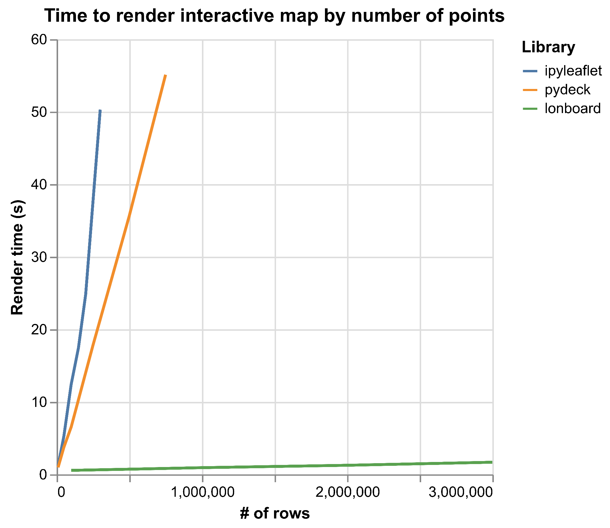

## "Hybrid" Python libraries

Python is among the most popular programming languages in the world. As a high-level, interpreted language, it's relatively easy to learn and fast to iterate on. But at the same time it's widely used in scientific computing, data science, and machine learning/AI.

Python's interpreted nature means that pure Python code can be slower to evaluate than similarly-implemented compiled code. But Python has a secret weapon here: Python can transparently integrate with compiled code. Many high-performance Python libraries are _hybrid_ in this way. They present a Python interface but rely heavily on compiled code for performance.

For example, [Numpy](https://numpy.org/), the fundamental Python library for scientific computing, _looks and functions_ like a Python library to any end user. But, quietly, its core functionality is provided from compiled C code. Indeed, more than a third of Numpy's source code is written in C or C++, and this is the essential reason why Numpy code executes so fast.

I believe Python will continue growing in demand, driven by the continued growth of AI and data science, making the value of high-performance, hybrid Python libraries greater than ever.

But writing performant Python bindings can be tricky. It's easy to run into pitfalls that slow down your code to a relative crawl, even if the underlying compiled code is fast.

This relatively high-level post will cover some ways to make hybrid Python-compiled code fast and how you can avoid the most common pitfalls. This post should appeal to any end user wondering why some Python libraries are so much faster than others, to any library author wondering how to make their Python bindings as fast as possible, or anyone wondering why I care so much about Apache Arrow. The techniques described here apply regardless of the underlying compiled language — C, C++, Rust, etc.

## What makes a hybrid Python library fast?

There are **three core areas** to speed up a compiled Python library:

- **Removing Python interpreter overhead**: ensuring that as much functionality as possible is provided by compiled code.
- **Removing serialization overhead**: reducing slowdowns from copying data into a representation accessible by the compiled code.
- **Improving performance of the underlying compiled code**.

These areas are independent, and striving to tackle all three is what makes a library lightning-fast.

As this post is focused on Python integration, we'll focus just on the first two.

## Python interpreter overhead

Because Python interpreter overhead can be significant, fast Python libraries need to — perhaps ironically — remove as much Python execution as possible from their runtime. Python should be considered only a convenient interface by which users can access native code, and Python calls should be limited to thin wrappers around native code.

The tricky bit is that we need to have an idea of how the end Python user will be using our library so that we can adapt the Python API to what they need to perform. Because end users will likely be writing code in pure Python, the more functionality end users must implement themselves, the worse their overall performance will be.

That doesn't mean that function calls should be monolithic. Quite the opposite; we still want a composable API. It's ok for the user to make several consecutive Python calls, as long as each call is itself maximally native. We want to present a clean, Pythonic, easy-to-use, modular interface that lets _as much execution time as possible_ happen in compiled code rather than Python code.

### Vectorization

One of the most common places of Python overhead is in a for loop. It follows, then, that one of the easiest places to find speedups is by removing Python-level for loops.

This is called _vectorization_: moving the Python for loop into native code by presenting a Python API that operates on _sequences_ of items at once, not scalars.

There do exist use cases that only care about comparing two scalar items, but in these situations a relatively small amount of the total execution time is likely happening in this function. So providing vectorized APIs tends to provide an easy performance win.

### Learning from the _Shapely_ v2 transition

Shapely is a Python library that provides bindings to the [GEOS](https://libgeos.org/) geometry engine, itself written in C++. Shapely [version 2](https://shapely.readthedocs.io/en/latest/release/2.x.html#version-2-0-0-2022-12-12) was heavily refactored to add vectorized APIs. Since the original scalar APIs still exist, this gives us a convenient way to compare the performance of scalar and vectorized APIs while the rest of the underlying C++ code remains unchanged.

First, we'll load in a moderately complex polygonal geometry from an example dataset of New York City boroughs provided by the [`geodatasets`](https://geodatasets.readthedocs.io/en/latest/) package:

```py
import shapely
import numpy as np
import geodatasets
import geopandas as gpd

# Load a sample dataset with MultiPolygon geometries
gdf = gpd.read_file(geodatasets.get_path("ny.bb"))
multi_polygon = gdf.geometry[0]
```

`multi_polygon` is now a Shapely geometry representing [Staten Island](https://en.wikipedia.org/wiki/Staten_Island). (It's a [`MultiPolygon`] because there are small islands off of the main island that are also considered part of Staten Island.)

[`MultiPolygon`]: https://shapely.readthedocs.io/en/latest/reference/shapely.MultiPolygon.html


Now let's define two functions:

1. One that uses the scalar-valued [`MultiPolygon.intersects`], where every Python call compares this _one_ `MultiPolygon` to _one_ other geometry
2. Another that uses Shapely's vectorized [`shapely.intersects`] — you can pass in an array of geometries and the single Python dispatch will operate on _all of them at once_.

[`MultiPolygon.intersects`]: https://shapely.readthedocs.io/en/2.1.1/reference/shapely.MultiPolygon.html#shapely.MultiPolygon.intersects
[`shapely.intersects`]: https://shapely.readthedocs.io/en/latest/reference/shapely.intersects.html#shapely.intersects

```py
def call_intersects_1000x(multi_polygon):
    # This function operates on a single scalar geometry with a Python for loop
    for _ in range(1000):
        multi_polygon.intersects(multi_polygon)


def vectorized_intersects_1000x(array_of_multi_polygons):
    # This function operates on all 1000 geometries at once
    shapely.intersects(array_of_multi_polygons, array_of_multi_polygons)
```

Now timing each of these (in [IPython](https://ipython.org/)) shows that the vectorized implementation, where the for loop is compiled, is **1100x faster** than the scalar implementation.

```py
%timeit call_intersects_1000x(multi_polygon)
# 2.2 ms ± 109 μs per loop (mean ± std. dev. of 7 runs, 100 loops each)

# Create an array with 1000 copies of the geometry
array_of_multi_polygons = np.repeat(multi_polygon, 1000)

%timeit vectorized_intersects_1000x(multi_polygon)
# 1.94 μs ± 79.3 ns per loop (mean ± std. dev. of 7 runs, 1,000,000 loops each)
```

While some sort of scalar API may often be necessary, having first-class vectorized APIs can provide _orders of magnitude_ improved performance.

## Serialization overhead

The previous section assumed our compiled code _already had access to our data_. Because the `multi_polygon` object was already a Shapely object, it was already in a format that the compiled Shapely code could operate on. This means the timings did not take into account the _creation_ of the geometry.

But in real-world use cases, making data accessible to the compiled code can be a critical slowdown.

Any time a native function is called from Python, the native code needs to be able to access and operate on the Python input. For simple parameters like integers and strings, this is straightforward and something usually handled by the binding glue generated by pyo3, Cython, pybind, etc. But for more complex input like structured tabular data, you usually have to choose your own serialization method.

### Simple serialization

The simplest way of exposing data to the compiled code is by _copying_ the input data into memory owned by the compiled code, simultaneously parsing it into a layout the compiled code can operate on.

For example, say you want to create a native function that allows a Shapely geometry as input. The Shapely object is an opaque binary blob, and it's not generally possible to directly access its coordinate information at the C level.

One way around this is to call [`shapely.to_geojson`](https://shapely.readthedocs.io/en/stable/reference/shapely.to_geojson.html) on the input. That returns a GeoJSON string that you can then parse with a JSON library in your compiled code.

But this is extremely slow! Accessing the input required a full copy to serialize into a string and then another full copy to deserialize into a representation your native library can handle.

### Binary serialization

One way to improve on this is to use faster serialization methods, especially preferring binary serialization over text serialization.

Shapely supports a compact binary serialization format for geometries called "Well-Known Binary" (WKB). So instead of going through GeoJSON, we can call [`shapely.to_wkb`](https://shapely.readthedocs.io/en/stable/reference/shapely.to_wkb.html) on the input, creating a binary buffer that we can parse from the compiled side with a WKB parser.

This is a bit faster, but this still requires two full memory copies. One copy from the Shapely source into a WKB binary buffer (which is more compact than a JSON string, but still a full memory copy), and then a second copy still for the serialization into the target memory format.

### Avoiding serialization altogether

So far we've assumed that the Python input is opaque at the binary level and not something that the compiled library can use directly. But what if we could change this constraint? Then we wouldn't need to pay the time or memory cost of _any_ serialization.

It is indeed possible in some cases for a compiled library to _directly access_ the underlying memory of the input, even when it comes from another compiled library. It can be highly performant but comes with a number of potential pitfalls.

For one, in order to do this safely, the two libraries must have total agreement over the exact shape and layout of how the data is stored at the binary level, called the [Application Binary Interface](https://en.wikipedia.org/wiki/Application_binary_interface) (ABI). In contrast to an API, the communcation of an _ABI_ happens at the binary level instead of at the language interface level.

But ABI compatibility can be extremely difficult to achieve. All libraries exchanging memory must be kept fully in sync with any ABI changes. Errors in ABI compatibility can lead to memory safety issues or a [segmentation fault](https://en.wikipedia.org/wiki/Segmentation_fault), which crashes the Python interpreter without a chance to recover.

Ideally we'd want some sort of standard that all libraries could adhere to so that an ecosystem of libraries could all implement the same internal binary representation, and then our code could safely exchange data without any copies. In the case of array-like and tabular data, these standards already exist!

### The Python Buffer Protocol

Others before me have run into problems with slow data interchange. In the early scientific Python ecosystem, libraries like NumPy and SciPy needed to exchange data but wanted to avoid serialization overhead.

[PEP 3118](https://peps.python.org/pep-3118/) — released as part of Python 3.0 in _2008_ — describes the Python [Buffer Protocol](http://jakevdp.github.io/blog/2014/05/05/introduction-to-the-python-buffer-protocol/), a [Python standard][buffer-protocol-docs] for exchanging binary buffers and multi-dimensional arrays.

Projects that implement the Buffer Protocol can safely read raw binary buffers and multidimensional arrays — without any copying — from any other library that exposes the interface.

The Buffer Protocol set the stage for a huge amount of innovation because it meant libraries could specialize on a narrow task while still freely integrating with the rest of the scientific Python ecosystem.

[buffer-protocol-docs]: https://docs.python.org/3/c-api/buffer.html

Jake VanderPlas, author of the [Python Data Science Handbook](https://jakevdp.github.io/PythonDataScienceHandbook/), [has described it as](https://jakevdp.github.io/blog/2014/05/05/introduction-to-the-python-buffer-protocol/):

> This cannot be emphasized enough: **it is fundamentally the Buffer Protocol and related NumPy functionality that make Python useful as a scientific computing platform.**

The Buffer Protocol is widely implemented, and its decentralized nature means that if you implement it in your library, your library will instantly be compatible with the full ecosystem.

### Apache Arrow & the Arrow C Data Interface

While the memory layout of a multidimensional array is straightforward and largely hasn't changed for decades, how to represent tabular data in memory is harder.

This is where [Apache Arrow](https://arrow.apache.org/) comes in. Arrow defines the binary layout — with a stable ABI — that has become the _lingua franca_ for representing tabular data in memory.

In turn, Arrow's [C Data Interface](https://arrow.apache.org/docs/format/CDataInterface.html) defines the binary interface for managing the data interchange across multiple programs in a single process, ensuring no invalid memory access nor memory leaks.

For Python libraries, ensure you also implement the [Arrow PyCapsule Interface](https://arrow.apache.org/docs/format/CDataInterface/PyCapsuleInterface.html), a layer on top of the C Data Interface that exposes well-known Python dunder methods, standardizing how libraries access each other's C Data Interface.

Arrow and the Arrow PyCapsule Interface is to structured tabular data what the Buffer Protocol is for buffer and array data: the pairing of an ABI stable memory layout with a Python-level interface standardizing memory semantics.
The PyCapsule Interface [has been implemented by](https://github.com/apache/arrow/issues/39195#issuecomment-2245718008) a wide array of Python dataframe and database libraries, and, similarly to the Buffer Protocol, its decentralized nature means that your library can instantly be compatible with all of them.

Future posts will dive into Arrow and the Arrow PyCapsule Interface in more detail, providing the best practices for how to make sure your library is compatible with the full Arrow PyCapsule ecosystem.

### Example: Lonboard performance

As an example of how much performance can be gained from minimizing serialization overhead, we can look to [Lonboard](https://developmentseed.org/lonboard), a Python library I develop for interactive geospatial visualization in Jupyter. Lonboard is a frontend for the [deck.gl](https://deck.gl/) JavaScript visualization library and needs to move all the input data from Python to the browser.

Pydeck, an earlier Python library, also used deck.gl for visualization but its performance suffered for large data input because it used JSON serialization to move data to the browser.

In contrast, Lonboard uses Arrow extensively. On the Python side, it uses the Arrow C Data Interface and PyCapsule Interface internally to exchange Arrow data between Python and a Rust core. Then it uses Parquet, an efficient serialization format for Arrow data, to send data to the browser. (We can't use the Arrow C Data Interface to share data between Python and the browser because browsers are sandboxed; their memory is isolated and kept separate from other programs like Python.) Inside the browser it can [again use the C Data Interface](https://github.com/kylebarron/arrow-js-ffi) to minimize data copies between the WebAssembly Parquet parser and the WebGL renderer. All of this results in a 30-40x speedup over pydeck by minimizing serialization costs and data transformations.



## Conclusion

To reduce Python interpreter overhead, move as many steps as you can into native code, using techniques like vectorization, while keeping in mind how your users actually want to run the code.

If you're working with numerical data, try to use and expose the buffer protocol. If you're working with tabular data, try to build your compiled code around the Arrow layout so that you get free interchange between your library and others. If you're working with tabular data but can't adopt Arrow as the native layout, it may still make sense to adopt Arrow as the data interchange format.

I hope this helps you make faster code! If you have thoughts, add a comment on LinkedIn.
